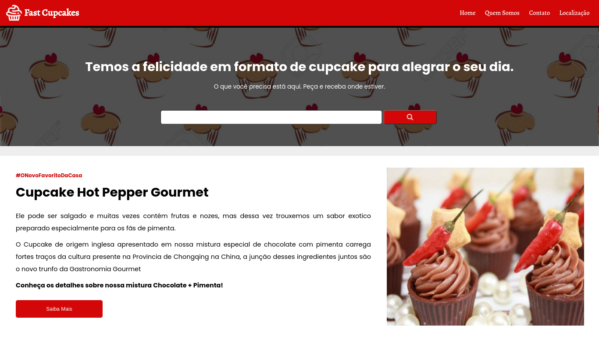
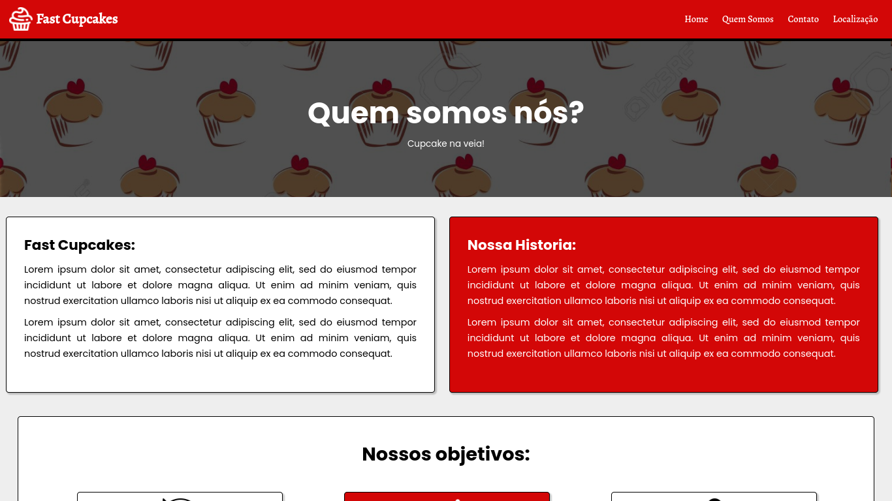

# 20028633-5_GabrielMoura

### Atividade MAPA - Disciplina BACK END I - CESUMAR

## Desenvolvido em:
- HTML5;
- CSS3;
- PHP
  
## Preview do projeto





## Pré-requisitos para rodar o site em sua maquina:
- Instalar  [Google Chrome](https://www.google.com/intl/pt-BR/chrome) e [Git](https://git-scm.com/downloads).
- Instalar [PHP](https://www.php.net/)
- Servidor web. Utilizado como base o [xampp](https://www.apachefriends.org/pt_br/index.html)
- Instale o [Gitbash](https://git-scm.com/downloads)

## Como rodar o projeto
Abra o terminal Git Bash no diretorio xampp/htdocs e cole o seguinte comando:
```
git clonehttps://github.com/gabriel-mo/20028633-5_GabrielMoura.git
```
##
- Gabriel Nascimento Moura
- RA = 20028633-5